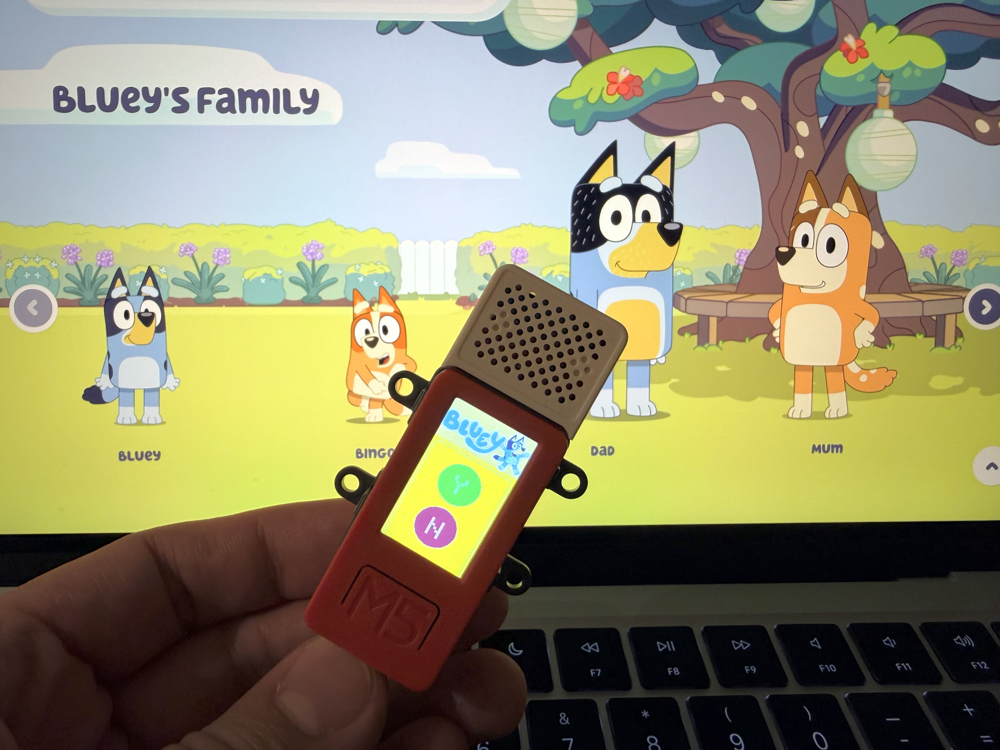
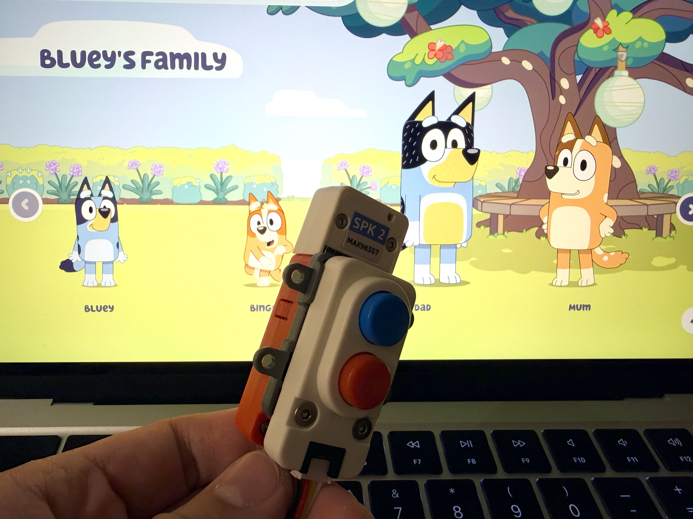

# Bluey Yes/No Button


A physical yes/no button toy inspired by the Bluey animated series, built with M5Stack StickC Plus.

## What We're Building


A fun, interactive toy featuring:
- **M5Stack StickC Plus** as the main controller
- **Hat SPK2** for audio output
- **Unit Dual Button** for physical input
- Yellow background UI with Green (Y) and Red (N) circular buttons
- Authentic sounds from the original [Bluey Yes/No Button](https://theyesnobutton.com) website

## Features

- Press the **blue button** to play the "Yes" sound
- Press the **red button** to play the "No" sound
- Visual feedback: buttons darken when pressed
- Startup chime: plays a pleasant melody on boot
- Auto power-off: shuts down after 5 minutes of inactivity

## Hardware Setup

| Module | Connection |
|--------|------------|
| StickC Plus | Main controller (GPIO 32/33 for buttons) |
| Hat SPK2 | I2S audio output (BCLK=26, LRC=0, DIN=25) |
| Unit Dual Button | Grove port (Blue=Yes, Red=No) |

## Final Product





## Build Instructions

### Hardware Requirements
- M5Stack StickC Plus
- Hat SPK2
- Unit Dual Button (or compatible button module)

### Software Setup
1. Install [PlatformIO](https://platformio.org/)
2. Clone this repository
3. Open `firmware/BlueyButton` in PlatformIO
4. Upload the firmware:
   ```bash
   pio run --target upload
   ```
5. Upload SPIFFS data:
   ```bash
   pio run --target uploadfs
   ```

## Project Structure

```
M5Stack-StickC-Plus-Bluey-YesNo/
├── firmware/BlueyButton/     # Main firmware
│   ├── src/                 # Source code
│   │   ├── main.cpp
│   │   └── bluey_logo.h     # Logo pixel data
│   └── data/                # Audio files (SPIFFS)
├── image/                   # Project images
├── docs/                    # Documentation
└── sounds/                   # Original audio files
```

## License

MIT License